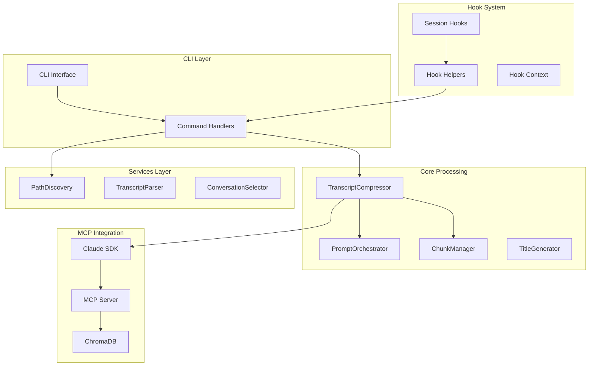
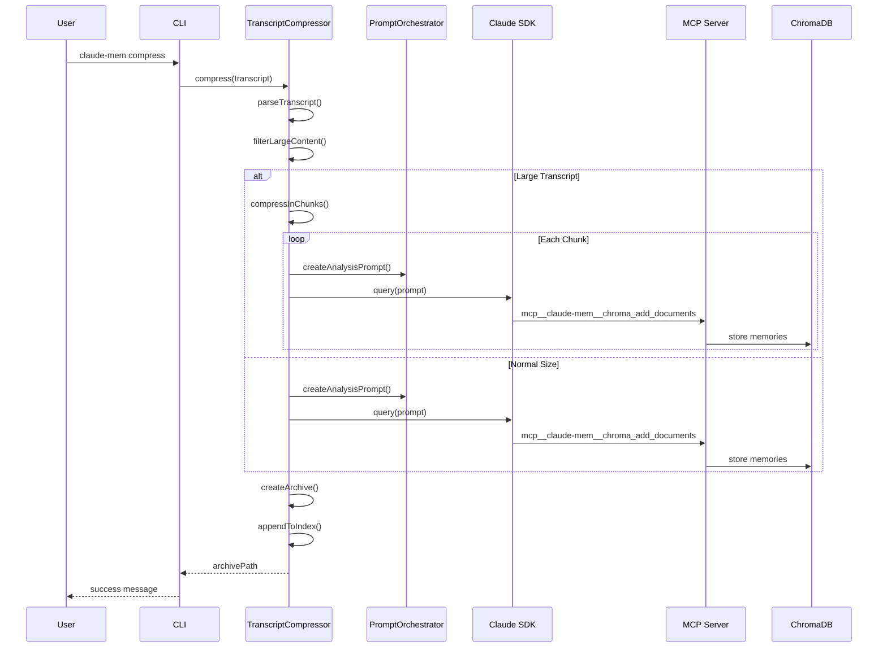
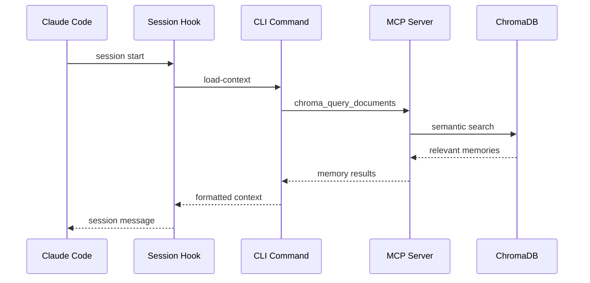
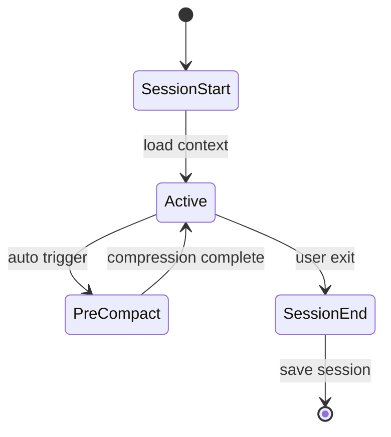

# System Architecture

Claude-mem is built around a modular architecture that separates concerns while maintaining high cohesion between components. This document explores the internal architecture, design decisions, and data flow patterns.

## Core Architecture Overview



## Component Details

### 1. TranscriptCompressor - Core Processing Engine

The `TranscriptCompressor` is the central orchestrator for memory creation:

```typescript
export class TranscriptCompressor {
  private paths: PathResolver;
  private promptOrchestrator: PromptOrchestrator;
  private chunkManager: ChunkManager;

  // Main compression workflow
  async compress(transcriptPath: string, sessionId?: string): Promise<string>
}
```

**Key Responsibilities:**
- Transcript parsing and message filtering
- Large content filtering and optimization
- Chunked processing for large transcripts
- Archive creation and indexing
- Claude SDK integration for analysis

**Design Pattern:** Orchestrator Pattern
- Coordinates multiple specialized components
- Manages complex multi-step workflows
- Provides centralized error handling

### 2. PromptOrchestrator - Centralized Prompt Management

```typescript
export class PromptOrchestrator {
  // Creates analysis prompts for LLM processing
  createAnalysisPrompt(context: AnalysisContext): AnalysisPrompt

  // Creates session start messages for human context
  createSessionStartPrompt(context: SessionContext): SessionPrompt

  // Creates hook responses for system integration
  createHookResponse(context: HookContext): HookResponse
}
```

**Design Principles:**
- Single source of truth for all prompt generation
- Type-safe context interfaces
- Template-based prompt construction
- Separation of concerns between prompt types

### 3. ChunkManager - Intelligent Content Splitting

```typescript
export class ChunkManager {
  // Determines if content needs chunking
  needsChunking(content: string): boolean

  // Splits content into manageable chunks
  chunkTranscript(filteredContent: string): Array<ChunkResult>

  // Estimates token usage
  estimateTokenCount(text: string): number
}
```

**Chunking Strategy:**
- Token-based size estimation (3.5 chars/token)
- Context preservation with message overlap
- Metadata tracking for chunk relationships
- Adaptive sizing based on content type

## Data Flow Architecture

### Memory Creation Pipeline



### Session Context Loading



## Memory Storage Architecture

### ChromaDB Integration via MCP

Claude-mem uses the Model Context Protocol (MCP) to interact with ChromaDB:

```typescript
// MCP tool calls in TranscriptCompressor
await query({
  prompt: analysisPrompt.prompt,
  options: {
    allowedTools: [
      'mcp__claude-mem__chroma_add_documents',
      'mcp__claude-mem__chroma_query_documents',
      'mcp__claude-mem__chroma_update_documents',
      // ... other Chroma tools
    ],
    pathToClaudeCodeExecutable: getClaudePath(),
  },
});
```

### Memory Document Structure

```typescript
interface MemoryDocument {
  type: "memory";
  text: string;           // Natural language description
  document_id: string;    // project_session_index format
  keywords: string;       // Comma-separated search terms
  session_id: string;     // Session identifier
  project: string;        // Project name
  timestamp: string;      // ISO timestamp
  archive: string;        // Archive filename reference
}
```

### Collection Strategy

- **Single Collection:** `claude_memories` for all projects
- **ID Format:** `{project}_{session}_{index}` ensures uniqueness
- **Metadata Filtering:** Project isolation via metadata queries
- **Semantic Search:** Vector embeddings for content similarity

## Hook System Architecture

### Hook Lifecycle



### Hook Implementation Pattern

```javascript
// Standardized hook structure
process.stdin.on('end', async () => {
  try {
    const payload = JSON.parse(input);

    // 1. Validate payload
    const validation = validateHookPayload(payload, 'HookType');

    // 2. Execute hook logic
    const result = await executeHookLogic(payload);

    // 3. Create standardized response
    const response = createHookResponse('HookType', result.success, result.data);

    console.log(JSON.stringify(response));
    process.exit(0);
  } catch (error) {
    // Standardized error handling
    const errorResponse = createHookResponse('HookType', false, {
      error: error.message
    });
    console.log(JSON.stringify(errorResponse));
    process.exit(0);
  }
});
```

## Path Resolution Strategy

### Multi-Environment Support

```typescript
export class PathResolver {
  // Discovers paths across different environments
  getConfigDir(): string      // ~/.claude-mem/
  getArchiveDir(): string     // ~/.claude-mem/archives/
  getIndexDir(): string       // ~/.claude-mem/
  getLogsDir(): string        // ~/.claude-mem/logs/

  // Project-specific paths
  getProjectArchiveDir(project: string): string
  getProjectPrefix(): string
}
```

### Path Discovery Algorithm

1. **Current Working Directory Analysis**
2. **Git Repository Detection**
3. **Project Name Extraction**
4. **Configuration Path Resolution**

## Error Handling Philosophy

### "Make It Work First" Implementation

Following the project's core philosophy, error handling is minimal and focused:

```typescript
// Natural failure - let real problems surface
const content = fs.readFileSync(transcriptPath, 'utf-8');
const messages = content.split('\n').map(line => JSON.parse(line));

// Continue processing even with parse errors
messages.forEach((msg, index) => {
  try {
    processMessage(msg);
  } catch (e) {
    log.debug(`Parse error on line ${index}: ${e.message}`);
    // Continue with next message
  }
});
```

### Graceful Degradation

- **Hook Failures:** Session continues with limited context
- **MCP Errors:** Return empty results, don't block operation
- **Parse Errors:** Skip malformed messages, process remainder
- **Storage Failures:** Log diagnostics, provide user feedback

## Performance Considerations

### Token Management

- **Estimation Algorithm:** 3.5 characters per token approximation
- **Chunk Sizing:** 22.4K tokens per chunk (20% buffer from 28K limit)
- **Context Overlap:** 2 messages between chunks for continuity

### Memory Optimization

- **Large Content Filtering:** 1MB threshold for tool results
- **Streaming Processing:** Handle large transcripts without loading entirely
- **Lazy Loading:** Commands load only required components

### Caching Strategy

- **Path Resolution:** Cache discovered paths per session
- **Project Detection:** Cache project metadata
- **Configuration:** Load once per process lifecycle

## Extension Points

### Custom Hook Development

1. **Hook Template System:** Standardized response formats
2. **Payload Validation:** Type-safe input processing
3. **Helper Functions:** Shared utilities for common operations

### Command Extensions

1. **Commander.js Integration:** Automatic CLI generation
2. **Option Parsing:** Consistent flag handling
3. **Error Reporting:** Standardized user feedback

### MCP Tool Integration

```typescript
// Adding new MCP tools to TranscriptCompressor
const allowedTools = [
  'mcp__claude-mem__chroma_add_documents',
  'mcp__claude-mem__chroma_query_documents',
  // Add new tools here
  'mcp__your-extension__custom_tool',
];
```

## Architecture Decisions & Trade-offs

### Why MCP Over Direct ChromaDB?

**Benefits:**
- Claude SDK integration for natural language processing
- Standardized tool interface
- Future flexibility for different backends

**Trade-offs:**
- Additional abstraction layer
- Dependency on Claude Code executable
- More complex error handling

### Why Single Collection Strategy?

**Benefits:**
- Simplified administration
- Cross-project discovery potential
- Consistent semantic search space

**Trade-offs:**
- Requires careful ID management
- Metadata filtering dependency
- Potential scaling concerns

### Why Chunking Over Summarization?

**Benefits:**
- Preserves conversation context
- No information loss
- Parallel processing capability

**Trade-offs:**
- Increased processing time
- More complex coordination
- Higher token usage

This architecture balances simplicity with extensibility, following the "Make It Work First" philosophy while providing solid foundations for advanced use cases.