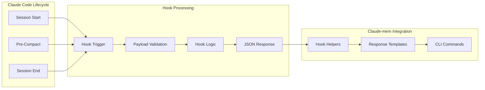

Extend claude-mem through custom hooks. Customize behavior, integrate with external tools, and adapt to specific workflows.

## Hook System Overview



## Built-in Hook Architecture

### Hook Execution Pattern

Standardized execution pattern:

```javascript
#!/usr/bin/env node

// 1. Import standardized helpers
import {
  createHookResponse,
  validateHookPayload,
  executeCliCommand,
  debugLog
} from './shared/hook-helpers.js';

// 2. Set up stdin processing
process.stdin.setEncoding('utf8');
process.stdin.resume();

let input = '';
process.stdin.on('data', chunk => {
  input += chunk;
});

// 3. Standardized processing
process.stdin.on('end', async () => {
  try {
    const payload = JSON.parse(input);

    // 4. Validate payload
    const validation = validateHookPayload(payload, 'HookType');
    if (!validation.valid) {
      const response = createHookResponse('HookType', false, {
        error: validation.error
      });
      console.log(JSON.stringify(response));
      process.exit(0);
    }

    // 5. Execute hook-specific logic
    const result = await executeHookLogic(payload);

    // 6. Create standardized response
    const response = createHookResponse('HookType', result.success, result.data);
    console.log(JSON.stringify(response));
    process.exit(0);

  } catch (error) {
    // 7. Standardized error handling
    const errorResponse = createHookResponse('HookType', false, {
      error: error.message
    });
    console.log(JSON.stringify(errorResponse));
    process.exit(0);
  }
});
```

### Hook Helper Functions

The shared helper system provides consistent functionality:

```javascript
// hook-helpers.js

/**
 * Creates standardized hook responses
 */
export function createHookResponse(hookType, success, data = {}) {
  return {
    continue: success,
    suppressOutput: data.suppressOutput || false,
    hookSpecificOutput: {
      hookEventName: hookType,
      ...data
    },
    timestamp: new Date().toISOString()
  };
}

/**
 * Validates hook payload structure
 */
export function validateHookPayload(payload, expectedType) {
  if (!payload || typeof payload !== 'object') {
    return { valid: false, error: 'Invalid payload structure' };
  }

  if (expectedType === 'SessionStart') {
    if (!payload.source) {
      return { valid: false, error: 'Missing source field' };
    }
  }

  return { valid: true };
}

/**
 * Executes CLI commands with standardized error handling
 */
export async function executeCliCommand(command, args) {
  return new Promise((resolve) => {
    const child = spawn(command, args, {
      stdio: ['pipe', 'pipe', 'pipe'],
      shell: true
    });

    let stdout = '';
    let stderr = '';

    child.stdout.on('data', (data) => {
      stdout += data.toString();
    });

    child.stderr.on('data', (data) => {
      stderr += data.toString();
    });

    child.on('close', (code) => {
      resolve({
        success: code === 0,
        stdout: stdout.trim(),
        stderr: stderr.trim(),
        exitCode: code
      });
    });
  });
}
```

## Creating Custom Hooks

### Step 1: Define Hook Purpose

Before creating a custom hook, clearly define:

- **Trigger Point:** When should the hook execute?
- **Input Data:** What information does it need?
- **Expected Output:** What should it produce?
- **Integration Points:** How does it interact with the system?

### Step 2: Hook Template

Create a new hook using this template:

```javascript
#!/usr/bin/env node

/**
 * Custom Hook Template
 * Replace HOOK_NAME with your specific hook name
 */

import path from 'path';
import { loadCliCommand } from './shared/config-loader.js';
import {
  createHookResponse,
  validateHookPayload,
  executeCliCommand,
  debugLog
} from './shared/hook-helpers.js';

const cliCommand = loadCliCommand();

// Set up stdin processing
process.stdin.setEncoding('utf8');
process.stdin.resume();

let input = '';
process.stdin.on('data', chunk => {
  input += chunk;
});

process.stdin.on('end', async () => {
  try {
    const payload = JSON.parse(input);
    debugLog('Custom hook started', { payload, hookType: 'HOOK_NAME' });

    // Custom validation logic
    const validation = validateCustomPayload(payload);
    if (!validation.valid) {
      const response = createHookResponse('HOOK_NAME', false, {
        error: validation.error
      });
      console.log(JSON.stringify(response));
      process.exit(0);
    }

    // Custom hook logic
    const result = await executeCustomLogic(payload);

    // Create response
    const response = createHookResponse('HOOK_NAME', result.success, result.data);
    console.log(JSON.stringify(response));
    process.exit(0);

  } catch (error) {
    debugLog('Custom hook error', { error: error.message });
    const response = createHookResponse('HOOK_NAME', false, {
      error: `Hook execution error: ${error.message}`
    });
    console.log(JSON.stringify(response));
    process.exit(0);
  }
});

/**
 * Custom validation for your hook
 */
function validateCustomPayload(payload) {
  // Add your validation logic here
  return { valid: true };
}

/**
 * Main hook logic implementation
 */
async function executeCustomLogic(payload) {
  // Implement your hook functionality here
  return {
    success: true,
    data: {
      message: 'Custom hook executed successfully'
    }
  };
}
```

### Step 3: Hook Registration

Register your hook in Claude Code's configuration:

```json
{
  "hooks": {
    "session-start": "./path/to/your/session-start-hook.js",
    "pre-compact": "./path/to/your/pre-compact-hook.js",
    "session-end": "./path/to/your/session-end-hook.js",
    "custom-trigger": "./path/to/your/custom-hook.js"
  }
}
```

## Hook Examples

### Example 1: Project-Specific Context Hook

```javascript
#!/usr/bin/env node

/**
 * Project-Specific Context Hook
 * Loads context based on project type and configuration
 */

import fs from 'fs';
import path from 'path';
import {
  createHookResponse,
  validateHookPayload,
  executeCliCommand,
  debugLog
} from './shared/hook-helpers.js';

process.stdin.setEncoding('utf8');
process.stdin.resume();

let input = '';
process.stdin.on('data', chunk => { input += chunk; });

process.stdin.on('end', async () => {
  try {
    const payload = JSON.parse(input);

    // Get project configuration
    const projectConfig = await loadProjectConfig();

    if (!projectConfig) {
      // No custom config, use default behavior
      const response = createHookResponse('SessionStart', true);
      console.log(JSON.stringify(response));
      process.exit(0);
    }

    // Load context based on project type
    const contextResult = await loadProjectSpecificContext(projectConfig);

    const response = createHookResponse('SessionStart', true, {
      context: contextResult.formattedContext,
      projectType: projectConfig.type,
      customSettings: projectConfig.settings
    });

    console.log(JSON.stringify(response));
    process.exit(0);

  } catch (error) {
    const response = createHookResponse('SessionStart', false, {
      error: error.message
    });
    console.log(JSON.stringify(response));
    process.exit(0);
  }
});

async function loadProjectConfig() {
  const configPath = path.join(process.cwd(), '.claude-mem-config.json');

  if (!fs.existsSync(configPath)) {
    return null;
  }

  try {
    const configContent = fs.readFileSync(configPath, 'utf-8');
    return JSON.parse(configContent);
  } catch (error) {
    debugLog('Failed to load project config', { error: error.message });
    return null;
  }
}

async function loadProjectSpecificContext(config) {
  const { type, settings } = config;

  switch (type) {
    case 'react':
      return await loadReactProjectContext(settings);
    case 'nodejs':
      return await loadNodeProjectContext(settings);
    case 'python':
      return await loadPythonProjectContext(settings);
    default:
      return await loadDefaultContext(settings);
  }
}

async function loadReactProjectContext(settings) {
  // Load React-specific context
  const context = [
    "## React Project Context",
    "This is a React application with the following key information:",
    ""
  ];

  // Add package.json info
  if (fs.existsSync('package.json')) {
    const packageInfo = JSON.parse(fs.readFileSync('package.json', 'utf-8'));
    context.push(`**Framework:** React ${packageInfo.dependencies?.react || 'unknown'}`);

    if (packageInfo.dependencies?.['next']) {
      context.push(`**Meta-framework:** Next.js ${packageInfo.dependencies.next}`);
    }
  }

  // Add component structure
  if (settings.includeComponentStructure) {
    const components = await findComponents();
    context.push("", "**Key Components:**");
    components.forEach(comp => context.push(`- ${comp}`));
  }

  return {
    formattedContext: context.join('\n'),
    projectType: 'react'
  };
}

async function findComponents() {
  // Simple component discovery
  const components = [];
  const srcPath = path.join(process.cwd(), 'src');

  if (fs.existsSync(srcPath)) {
    const files = fs.readdirSync(srcPath, { recursive: true });
    components.push(...files
      .filter(file => file.endsWith('.jsx') || file.endsWith('.tsx'))
      .map(file => path.basename(file, path.extname(file)))
    );
  }

  return components;
}
```

### Example 2: Auto-Documentation Hook

```javascript
#!/usr/bin/env node

/**
 * Auto-Documentation Hook
 * Automatically generates documentation from session memories
 */

import fs from 'fs';
import path from 'path';
import {
  createHookResponse,
  executeCliCommand,
  debugLog
} from './shared/hook-helpers.js';

process.stdin.setEncoding('utf8');
process.stdin.resume();

let input = '';
process.stdin.on('data', chunk => { input += chunk; });

process.stdin.on('end', async () => {
  try {
    const payload = JSON.parse(input);

    // Only run on session end
    if (payload.trigger !== 'session-end') {
      const response = createHookResponse('SessionEnd', true);
      console.log(JSON.stringify(response));
      process.exit(0);
    }

    // Extract session info
    const sessionId = payload.session_id;
    const projectName = path.basename(process.cwd());

    // Generate documentation from session
    const docResult = await generateSessionDocumentation(sessionId, projectName);

    if (docResult.success) {
      const response = createHookResponse('SessionEnd', true, {
        message: `Documentation generated: ${docResult.filePath}`,
        documentationPath: docResult.filePath
      });
      console.log(JSON.stringify(response));
    } else {
      const response = createHookResponse('SessionEnd', true, {
        message: 'Documentation generation skipped (no significant changes detected)'
      });
      console.log(JSON.stringify(response));
    }

    process.exit(0);

  } catch (error) {
    const response = createHookResponse('SessionEnd', false, {
      error: error.message
    });
    console.log(JSON.stringify(response));
    process.exit(0);
  }
});

async function generateSessionDocumentation(sessionId, projectName) {
  // Query memories for this session
  const contextResult = await executeCliCommand('claude-mem', [
    'load-context',
    '--project', projectName,
    '--format', 'json',
    '--count', '50'
  ]);

  if (!contextResult.success || !contextResult.stdout) {
    return { success: false, reason: 'No memories found' };
  }

  let memories;
  try {
    memories = JSON.parse(contextResult.stdout);
  } catch (e) {
    return { success: false, reason: 'Invalid memory format' };
  }

  // Filter memories for this session
  const sessionMemories = memories.filter(m =>
    m.session_id === sessionId
  );

  if (sessionMemories.length === 0) {
    return { success: false, reason: 'No session memories found' };
  }

  // Generate documentation
  const documentation = generateMarkdownDoc(sessionMemories, sessionId);

  // Save to docs directory
  const docsDir = path.join(process.cwd(), 'docs', 'sessions');
  fs.mkdirSync(docsDir, { recursive: true });

  const docPath = path.join(docsDir, `${sessionId}.md`);
  fs.writeFileSync(docPath, documentation);

  return {
    success: true,
    filePath: docPath
  };
}

function generateMarkdownDoc(memories, sessionId) {
  const timestamp = new Date().toISOString().split('T')[0];

  let doc = `# Session Documentation\n\n`;
  doc += `**Session ID:** ${sessionId}  \n`;
  doc += `**Date:** ${timestamp}  \n`;
  doc += `**Generated:** ${new Date().toISOString()}  \n\n`;

  // Group memories by type
  const groupedMemories = {};
  memories.forEach(memory => {
    const type = memory.type || 'general';
    if (!groupedMemories[type]) {
      groupedMemories[type] = [];
    }
    groupedMemories[type].push(memory);
  });

  // Generate sections
  Object.entries(groupedMemories).forEach(([type, typeMemories]) => {
    doc += `## ${type.charAt(0).toUpperCase() + type.slice(1)}s\n\n`;

    typeMemories.forEach(memory => {
      doc += `### ${memory.text}\n\n`;
      if (memory.keywords) {
        doc += `**Keywords:** ${memory.keywords}  \n`;
      }
      if (memory.context) {
        doc += `**Context:** ${memory.context}  \n`;
      }
      doc += '\n';
    });
  });

  return doc;
}
```

### Example 3: Integration Hook

```javascript
#!/usr/bin/env node

/**
 * Integration Hook
 * Integrates with external tools and services
 */

import { exec } from 'child_process';
import { promisify } from 'util';
import {
  createHookResponse,
  debugLog
} from './shared/hook-helpers.js';

const execAsync = promisify(exec);

process.stdin.setEncoding('utf8');
process.stdin.resume();

let input = '';
process.stdin.on('data', chunk => { input += chunk; });

process.stdin.on('end', async () => {
  try {
    const payload = JSON.parse(input);

    // Run integrations based on hook type
    const integrations = await runIntegrations(payload);

    const response = createHookResponse(payload.trigger || 'Custom', true, {
      integrations: integrations,
      message: `Executed ${integrations.length} integrations`
    });

    console.log(JSON.stringify(response));
    process.exit(0);

  } catch (error) {
    const response = createHookResponse('Custom', false, {
      error: error.message
    });
    console.log(JSON.stringify(response));
    process.exit(0);
  }
});

async function runIntegrations(payload) {
  const integrations = [];

  // Git integration
  try {
    await syncWithGit();
    integrations.push({ name: 'git', status: 'success' });
  } catch (error) {
    integrations.push({ name: 'git', status: 'error', error: error.message });
  }

  // Slack notification
  try {
    await sendSlackNotification(payload);
    integrations.push({ name: 'slack', status: 'success' });
  } catch (error) {
    integrations.push({ name: 'slack', status: 'error', error: error.message });
  }

  // JIRA integration
  try {
    await updateJiraTickets(payload);
    integrations.push({ name: 'jira', status: 'success' });
  } catch (error) {
    integrations.push({ name: 'jira', status: 'error', error: error.message });
  }

  return integrations;
}

async function syncWithGit() {
  // Auto-commit session changes if configured
  const gitConfig = process.env.CLAUDE_MEM_AUTO_COMMIT;
  if (gitConfig === 'true') {
    await execAsync('git add -A');
    await execAsync('git commit -m "Auto-commit: Claude session completed"');
  }
}

async function sendSlackNotification(payload) {
  const webhookUrl = process.env.SLACK_WEBHOOK_URL;
  if (!webhookUrl) return;

  const message = {
    text: `Claude session completed`,
    attachments: [{
      color: 'good',
      fields: [
        { title: 'Session ID', value: payload.session_id, short: true },
        { title: 'Project', value: payload.project_name, short: true }
      ]
    }]
  };

  // Send webhook (implementation depends on your HTTP client)
  await sendWebhook(webhookUrl, message);
}

async function updateJiraTickets(payload) {
  // Extract ticket references from session and update status
  const jiraConfig = process.env.JIRA_CONFIG;
  if (!jiraConfig) return;

  // Implementation depends on JIRA API client
  debugLog('JIRA integration executed');
}
```

## Advanced Hook Patterns

### Conditional Hook Execution

```javascript
// Execute hook only under certain conditions
async function shouldExecuteHook(payload) {
  const projectType = await detectProjectType();
  const currentBranch = await getCurrentGitBranch();
  const timeOfDay = new Date().getHours();

  return (
    projectType === 'production' &&
    currentBranch === 'main' &&
    timeOfDay >= 9 && timeOfDay <= 17
  );
}

// In hook main logic
if (await shouldExecuteHook(payload)) {
  await executeHookLogic(payload);
} else {
  // Skip execution
  const response = createHookResponse('HookType', true, {
    message: 'Hook execution skipped based on conditions'
  });
  console.log(JSON.stringify(response));
  process.exit(0);
}
```

### Async Hook Coordination

```javascript
// Coordinate multiple async operations
async function coordinatedHookExecution(payload) {
  const operations = [
    () => updateDocumentation(payload),
    () => syncWithCloud(payload),
    () => notifyTeam(payload)
  ];

  // Run operations in parallel with error isolation
  const results = await Promise.allSettled(
    operations.map(op => op())
  );

  const summary = results.map((result, index) => ({
    operation: operations[index].name,
    status: result.status,
    error: result.status === 'rejected' ? result.reason.message : null
  }));

  return summary;
}
```

### Configuration-Driven Hooks

```javascript
// Load hook configuration from multiple sources
function loadHookConfig() {
  const sources = [
    path.join(process.cwd(), '.claude-mem-hook.json'),     // Project level
    path.join(os.homedir(), '.claude-mem-hook.json'),      // User level
    process.env.CLAUDE_MEM_HOOK_CONFIG                     // Environment
  ];

  let config = {};

  sources.forEach(source => {
    if (source && fs.existsSync(source)) {
      try {
        const sourceConfig = JSON.parse(fs.readFileSync(source, 'utf-8'));
        config = { ...config, ...sourceConfig };
      } catch (error) {
        debugLog(`Failed to load config from ${source}`, { error: error.message });
      }
    }
  });

  return config;
}

// Use configuration to drive hook behavior
const config = loadHookConfig();

if (config.enableDocGeneration) {
  await generateDocumentation(payload);
}

if (config.integrations?.slack?.enabled) {
  await sendSlackNotification(payload, config.integrations.slack);
}
```

## Testing Custom Hooks

### Hook Testing Framework

```javascript
// test-hook.js
import { spawn } from 'child_process';
import fs from 'fs';

export class HookTester {
  constructor(hookPath) {
    this.hookPath = hookPath;
  }

  async testHook(payload, expectedOutcome = 'success') {
    return new Promise((resolve) => {
      const hook = spawn('node', [this.hookPath], {
        stdio: ['pipe', 'pipe', 'pipe']
      });

      let stdout = '';
      let stderr = '';

      hook.stdout.on('data', (data) => {
        stdout += data.toString();
      });

      hook.stderr.on('data', (data) => {
        stderr += data.toString();
      });

      hook.on('close', (code) => {
        try {
          const response = JSON.parse(stdout);
          resolve({
            success: code === 0,
            response,
            stderr,
            code
          });
        } catch (error) {
          resolve({
            success: false,
            error: 'Invalid JSON response',
            stdout,
            stderr,
            code
          });
        }
      });

      // Send payload to hook
      hook.stdin.write(JSON.stringify(payload));
      hook.stdin.end();
    });
  }
}

// Usage
const tester = new HookTester('./my-custom-hook.js');

const testPayload = {
  trigger: 'session-start',
  session_id: 'test-session',
  project_name: 'test-project'
};

const result = await tester.testHook(testPayload);
console.log('Hook test result:', result);
```

### Integration Testing

```javascript
// integration-test.js
import { execSync } from 'child_process';
import fs from 'fs';
import path from 'path';

export async function testHookIntegration() {
  // Set up test environment
  const testDir = '/tmp/claude-mem-hook-test';
  fs.mkdirSync(testDir, { recursive: true });
  process.chdir(testDir);

  // Install hook
  execSync('claude-mem install --local --path ./hooks');

  // Create test session
  const sessionId = 'test-' + Date.now();
  const transcriptPath = path.join(testDir, `${sessionId}.jsonl`);

  // Create mock transcript
  fs.writeFileSync(transcriptPath, JSON.stringify({
    type: 'user',
    content: 'Test message',
    timestamp: new Date().toISOString()
  }));

  // Run compression (triggers hooks)
  execSync(`claude-mem compress ${transcriptPath}`);

  // Verify hook execution
  const hookLogPath = path.join(testDir, '.claude-mem', 'hook-test.log');
  const hookExecuted = fs.existsSync(hookLogPath);

  // Clean up
  fs.rmSync(testDir, { recursive: true, force: true });

  return { hookExecuted };
}
```

## Deployment and Distribution

### Hook Package Structure

```
my-claude-mem-hooks/
├── package.json
├── README.md
├── hooks/
│   ├── session-start.js
│   ├── pre-compact.js
│   └── session-end.js
├── shared/
│   ├── config.js
│   └── utils.js
├── tests/
│   ├── test-session-start.js
│   └── test-integration.js
└── install.js
```

### Package Installation Script

```javascript
// install.js
#!/usr/bin/env node

import fs from 'fs';
import path from 'path';
import { execSync } from 'child_process';

const HOOK_DIR = path.join(process.cwd(), 'hooks');
const TARGET_DIR = path.join(os.homedir(), '.claude-mem', 'custom-hooks');

console.log('Installing custom claude-mem hooks...');

// Create target directory
fs.mkdirSync(TARGET_DIR, { recursive: true });

// Copy hooks
const hooks = fs.readdirSync(HOOK_DIR);
hooks.forEach(hook => {
  const source = path.join(HOOK_DIR, hook);
  const target = path.join(TARGET_DIR, hook);
  fs.copyFileSync(source, target);
  fs.chmodSync(target, '755');
  console.log(`Installed: ${hook}`);
});

// Register hooks with claude-mem
execSync('claude-mem install --force', { stdio: 'inherit' });

console.log('Custom hooks installed successfully!');
```

Custom hooks enable powerful workflow integration while maintaining the simplicity and reliability that characterizes claude-mem. The standardized patterns ensure consistent behavior and easy maintenance across different hook implementations.