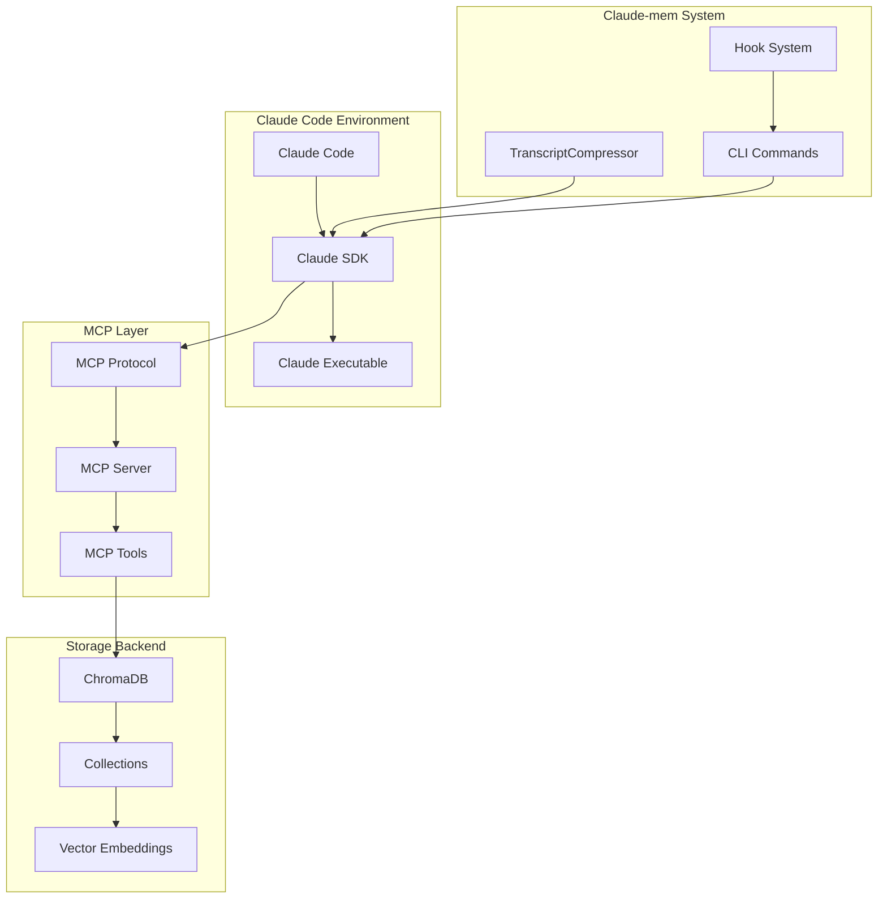
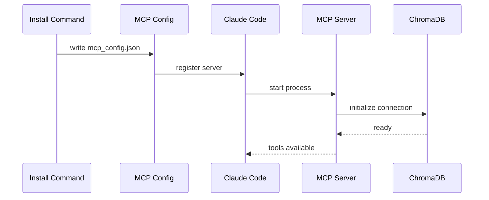

Claude-mem's integration with the Model Context Protocol (MCP) is fundamental to its memory management capabilities. This document explains how MCP enables seamless interaction between Claude, the memory system, and ChromaDB.

## MCP Architecture Overview



## MCP Server Configuration

### Discovery and Setup

Claude-mem automatically configures the MCP server during installation:

```typescript
// MCP server configuration in install command
const mcpServer = {
  command: "claude-mem",
  args: ["mcp-server"],
  env: {
    CHROMA_DB_PATH: chromaDbPath,
    DEBUG: "false"
  }
};
```

### Configuration File Management

```typescript
// PathDiscovery finds MCP configuration files
export class PathDiscovery {
  getMcpConfigPath(): string {
    // ~/.claude/mcp_config.json (user level)
  }

  getProjectMcpConfigPath(): string {
    // ./.claude/mcp_config.json (project level)
  }
}
```

## Available MCP Tools

Claude-mem provides a comprehensive set of MCP tools for ChromaDB interaction:

### Collection Management Tools

```typescript
// Collection operations
'mcp__claude-mem__chroma_list_collections'     // List all collections
'mcp__claude-mem__chroma_create_collection'    // Create new collection
'mcp__claude-mem__chroma_get_collection_info'  // Get collection metadata
'mcp__claude-mem__chroma_get_collection_count' // Count documents
'mcp__claude-mem__chroma_modify_collection'    // Update collection settings
'mcp__claude-mem__chroma_fork_collection'      // Duplicate collection
'mcp__claude-mem__chroma_delete_collection'    // Remove collection
'mcp__claude-mem__chroma_peek_collection'      // Preview collection content
```

### Document Management Tools

```typescript
// Document operations
'mcp__claude-mem__chroma_add_documents'        // Store new memories
'mcp__claude-mem__chroma_query_documents'      // Semantic search
'mcp__claude-mem__chroma_get_documents'        // Retrieve by ID/filters
'mcp__claude-mem__chroma_update_documents'     // Modify existing memories
'mcp__claude-mem__chroma_delete_documents'     // Remove memories
```

## Tool Usage Patterns

### Memory Storage Pattern

During transcript compression, claude-mem uses this pattern:

```typescript
// In TranscriptCompressor.compress()
const response = await query({
  prompt: analysisPrompt.prompt,
  options: {
    allowedTools: [
      'mcp__claude-mem__chroma_add_documents',
      'mcp__claude-mem__chroma_query_documents',
      'mcp__claude-mem__chroma_update_documents',
      // ... other tools
    ],
    pathToClaudeCodeExecutable: getClaudePath(),
  },
});
```

### Analysis Prompt Integration

The analysis prompt guides Claude to use MCP tools:

```handlebars
STORAGE INSTRUCTIONS:
Call mcp__claude-mem__chroma_add_documents with:
- collection_name: "claude_memories"
- documents: Array of natural language descriptions
- ids: ["{{projectPrefix}}_{{sessionId}}_1", "{{projectPrefix}}_{{sessionId}}_2", ...]
- metadatas: Array with fields:
  * type: component/pattern/workflow/integration/concept/decision/tool/fix
  * keywords: Comma-separated search terms
  * context: Brief situation description
  * timestamp: "{{timestamp}}"
  * session_id: "{{sessionId}}"

ERROR HANDLING:
If you get "IDs already exist" errors, use mcp__claude-mem__chroma_update_documents instead.
If any tool calls fail, continue and return the JSON response anyway.
```

### Memory Retrieval Pattern

When loading context for new sessions:

```typescript
// In load-context command
async function loadRecentMemories(projectName: string, count: number) {
  // Claude automatically calls mcp__claude-mem__chroma_query_documents
  // with semantic search based on project and recency
}
```

## Data Structures and Schemas

### Memory Document Schema

```typescript
interface MemoryDocument {
  // Document content (vector embedded by ChromaDB)
  text: string;

  // Unique identifier following project_session_index pattern
  id: string;

  // Rich metadata for filtering and organization
  metadata: {
    type: 'component' | 'pattern' | 'workflow' | 'integration' |
          'concept' | 'decision' | 'tool' | 'fix';
    keywords: string;        // Comma-separated search terms
    context: string;         // Brief situation description
    timestamp: string;       // ISO 8601 timestamp
    session_id: string;      // Session identifier
    project: string;         // Project name for filtering
    archive: string;         // Reference to archived transcript
  };
}
```

### Collection Strategy

Claude-mem uses a **single collection approach** with project isolation:

```typescript
// Single collection for all projects
const COLLECTION_NAME = "claude_memories";

// Project isolation via metadata filtering
const projectFilter = {
  where: {
    project: { $eq: projectName }
  }
};

// ID uniqueness via project prefix
const documentId = `${projectPrefix}_${sessionId}_${index}`;
```

## Tool Call Examples

### Adding Memories

```typescript
// Typical tool call from Claude during analysis
{
  tool: "mcp__claude-mem__chroma_add_documents",
  parameters: {
    collection_name: "claude_memories",
    documents: [
      "Implemented authentication middleware using JWT tokens for Express.js application",
      "Created user registration form with validation using React Hook Form and Zod schema"
    ],
    ids: [
      "myproject_session123_1",
      "myproject_session123_2"
    ],
    metadatas: [
      {
        type: "component",
        keywords: "authentication, jwt, middleware, express",
        context: "Adding security to web application",
        timestamp: "2024-01-15T10:30:00Z",
        session_id: "session123",
        project: "myproject",
        archive: "session123.jsonl.archive"
      },
      {
        type: "component",
        keywords: "form, validation, react, zod",
        context: "User interface for registration",
        timestamp: "2024-01-15T10:30:00Z",
        session_id: "session123",
        project: "myproject",
        archive: "session123.jsonl.archive"
      }
    ]
  }
}
```

### Querying Memories

```typescript
// Semantic search for relevant memories
{
  tool: "mcp__claude-mem__chroma_query_documents",
  parameters: {
    collection_name: "claude_memories",
    query_texts: ["authentication setup", "user login implementation"],
    n_results: 5,
    where: {
      project: { $eq: "myproject" }
    },
    include: ["documents", "metadatas", "distances"]
  }
}
```

### Updating Memories

```typescript
// Handle ID conflicts by updating existing memories
{
  tool: "mcp__claude-mem__chroma_update_documents",
  parameters: {
    collection_name: "claude_memories",
    ids: ["myproject_session123_1"],
    documents: ["Updated authentication middleware to support refresh tokens and role-based access"],
    metadatas: [{
      type: "component",
      keywords: "authentication, jwt, refresh-tokens, rbac, middleware",
      context: "Enhanced security with token refresh and roles",
      timestamp: "2024-01-15T14:30:00Z",
      session_id: "session123",
      project: "myproject",
      archive: "session123.jsonl.archive"
    }]
  }
}
```

## Error Handling in MCP Context

### Tool Call Failures

Claude-mem implements graceful degradation when MCP tools fail:

```typescript
// In analysis prompt template
ERROR HANDLING:
If you get "IDs already exist" errors, use mcp__claude-mem__chroma_update_documents instead.
If any tool calls fail, continue and return the JSON response anyway.
```

### Connection Issues

```typescript
// In TranscriptCompressor
try {
  const response = await query({
    prompt: analysisPrompt.prompt,
    options: { allowedTools, pathToClaudeCodeExecutable }
  });
} catch (error) {
  log.error('MCP communication failed', error);
  // Continue with empty result rather than failing
  return { summaries: [], overview: null };
}
```

### Validation Patterns

```typescript
// Validate tool responses before processing
private validateToolResponse(response: any): boolean {
  if (!response || typeof response !== 'object') return false;
  if (!response.summaries || !Array.isArray(response.summaries)) return false;

  return response.summaries.every(summary =>
    summary.text && summary.document_id && summary.keywords
  );
}
```

## MCP Server Implementation Details

### Server Lifecycle



### Tool Registration

```typescript
// MCP server registers tools for Claude to use
const tools = [
  {
    name: "chroma_add_documents",
    description: "Add documents to a ChromaDB collection",
    inputSchema: {
      type: "object",
      properties: {
        collection_name: { type: "string" },
        documents: { type: "array", items: { type: "string" } },
        ids: { type: "array", items: { type: "string" } },
        metadatas: { type: "array", items: { type: "object" } }
      },
      required: ["collection_name", "documents", "ids"]
    }
  },
  // ... other tools
];
```

## Advanced MCP Usage

### Custom Tool Development

To extend claude-mem with custom MCP tools:

1. **Define Tool Schema**
```typescript
const customTool = {
  name: "claude_mem_custom_analyzer",
  description: "Custom analysis for specific project types",
  inputSchema: {
    type: "object",
    properties: {
      analysis_type: { type: "string" },
      content: { type: "string" }
    }
  }
};
```

2. **Implement Tool Handler**
```typescript
async function handleCustomAnalyzer(params: any) {
  // Custom analysis logic
  return {
    result: "analysis complete",
    metadata: { /* custom data */ }
  };
}
```

3. **Register with MCP Server**
```typescript
mcpServer.registerTool("claude_mem_custom_analyzer", handleCustomAnalyzer);
```

### Batch Operations

For large-scale memory operations:

```typescript
// Batch document addition with error recovery
async function batchAddMemories(memories: MemoryDocument[]) {
  const batchSize = 100;
  const batches = chunk(memories, batchSize);

  for (const batch of batches) {
    try {
      await addDocumentsBatch(batch);
    } catch (error) {
      // Retry individual documents on batch failure
      for (const memory of batch) {
        try {
          await addSingleDocument(memory);
        } catch (individualError) {
          log.debug(`Failed to add memory: ${memory.id}`);
        }
      }
    }
  }
}
```

### Cross-Project Queries

```typescript
// Query across multiple projects
{
  tool: "mcp__claude-mem__chroma_query_documents",
  parameters: {
    collection_name: "claude_memories",
    query_texts: ["react component patterns"],
    n_results: 10,
    where: {
      $or: [
        { project: { $eq: "project1" } },
        { project: { $eq: "project2" } }
      ]
    }
  }
}
```

## Performance Considerations

### Embedding Generation

ChromaDB automatically generates embeddings for document text:

- **Model:** Uses sentence-transformers by default
- **Dimensionality:** Typically 384 or 768 dimensions
- **Performance:** ~1000 documents/minute on modern hardware

### Query Optimization

```typescript
// Optimize queries with appropriate filters
const optimizedQuery = {
  query_texts: ["specific search terms"],
  n_results: 5,  // Limit results for performance
  where: {
    project: { $eq: projectName },  // Filter early
    timestamp: { $gte: recentDate }  // Time-based filtering
  },
  include: ["documents", "metadatas"]  // Only needed fields
};
```

### Connection Pooling

The MCP server manages ChromaDB connections efficiently:

```typescript
// Connection reuse across tool calls
class ChromaMCPServer {
  private client: ChromaClient;

  constructor() {
    this.client = new ChromaClient({
      path: process.env.CHROMA_DB_PATH
    });
  }

  // Reuse connection for all operations
  async handleToolCall(tool: string, params: any) {
    return this.client[tool](params);
  }
}
```

## Debugging MCP Integration

### Tool Call Tracing

Enable debugging to trace MCP tool calls:

```bash
# Enable MCP debugging
export DEBUG=mcp:*

# Run claude-mem with verbose logging
claude-mem compress --verbose
```

### Response Validation

```typescript
// Debug MCP responses in TranscriptCompressor
private debugMCPResponse(response: any): void {
  const debugPath = path.join(this.paths.getLogsDir(),
    `mcp-response-${Date.now()}.json`);
  fs.writeFileSync(debugPath, JSON.stringify(response, null, 2));
  this.debugLog(`MCP response saved to: ${debugPath}`);
}
```

### Connection Testing

```typescript
// Test MCP connection health
async function testMCPConnection(): Promise<boolean> {
  try {
    const response = await query({
      prompt: "Test MCP connection by listing collections",
      options: {
        allowedTools: ["mcp__claude-mem__chroma_list_collections"],
        pathToClaudeCodeExecutable: getClaudePath()
      }
    });
    return true;
  } catch (error) {
    log.error("MCP connection failed", error);
    return false;
  }
}
```

The MCP integration in claude-mem provides a robust, extensible foundation for memory management while maintaining the simplicity and reliability that characterizes the entire system.