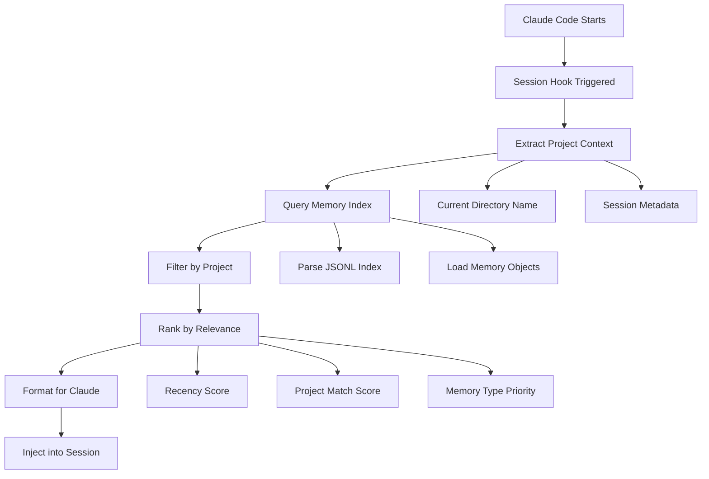

Understand how claude-mem selects, filters, and presents memories to maximize your persistent context system.

## Loading Process Overview

Context loading provides relevant memories when Claude Code starts:



### Core Components

<CardGrid>
  <Card title="Project Detection" icon="folder">
    **Automatic Project Identification**
    - Uses current directory name as project identifier
    - Filters memories to relevant project context
    - Supports cross-project knowledge sharing
  </Card>
  <Card title="Memory Filtering" icon="filter">
    **Intelligent Memory Selection**
    - Recent memories prioritized
    - Project-specific memories preferred
    - Overview memories always included
    - Stale memories excluded
  </Card>
  <Card title="Relevance Ranking" icon="star">
    **Smart Prioritization**
    - Temporal relevance (newer = higher priority)
    - Content type weighting
    - Session context matching
    - User engagement signals
  </Card>
  <Card title="Context Formatting" icon="text">
    **Claude-Optimized Presentation**
    - Structured memory sections
    - Clear project identification
    - Actionable insights emphasized
    - Progress indicators included
  </Card>
</CardGrid>

## Memory Index Structure

Memories stored in JSONL format for efficient processing:

### Memory Entry Schema

```typescript
interface MemoryEntry {
  // Core content
  text: string;              // Compressed insight or summary
  project: string;           // Project identifier
  timestamp: string;         // ISO 8601 timestamp

  // Memory classification
  type: 'memory' | 'overview' | 'session' | 'decision';
  entity_type?: string;      // Technical classification

  // Metadata
  document_id: string;       // Unique identifier
  keywords: string[];        // Searchable tags
  session_id?: string;       // Source session

  // Optional enrichment
  confidence?: number;       // Quality score (0-1)
  context?: string;         // Additional context
  relationships?: string[];  // Related memory IDs
}
```

### Example Memory Entries

<AccordionGroup>
  <Accordion title="Technical Insight Memory">
    ```json
    {
      "text": "Authentication implementation uses JWT with refresh token rotation for enhanced security",
      "project": "ecommerce-app",
      "timestamp": "2024-09-15T10:30:00Z",
      "type": "memory",
      "entity_type": "implementation",
      "document_id": "ecommerce-app_auth_pattern_20240915",
      "keywords": ["authentication", "jwt", "security", "refresh-tokens"],
      "session_id": "session_20240915_103000",
      "confidence": 0.95
    }
    ```
  </Accordion>

  <Accordion title="Project Overview Memory">
    ```json
    {
      "text": "E-commerce platform using React/TypeScript frontend, Node.js/Express backend, PostgreSQL database",
      "project": "ecommerce-app",
      "timestamp": "2024-09-15T09:00:00Z",
      "type": "overview",
      "entity_type": "architecture",
      "document_id": "ecommerce-app_overview_20240915",
      "keywords": ["react", "typescript", "nodejs", "postgresql", "architecture"],
      "confidence": 1.0
    }
    ```
  </Accordion>

  <Accordion title="Decision Record Memory">
    ```json
    {
      "text": "Chose Zustand over Redux for state management due to simpler API and smaller bundle size",
      "project": "ecommerce-app",
      "timestamp": "2024-09-15T11:15:00Z",
      "type": "decision",
      "entity_type": "architecture_decision",
      "document_id": "ecommerce-app_zustand_decision_20240915",
      "keywords": ["state-management", "zustand", "redux", "decision"],
      "context": "Team preferred minimal boilerplate for this project",
      "confidence": 0.9
    }
    ```
  </Accordion>
</AccordionGroup>

## Project-Based Filtering

### Project Identification

```mermaid
graph LR
    A[Claude Code Working Directory] --> B[Extract Directory Name]
    B --> C[Use as Project Filter]
    C --> D[Match Against Memory Entries]

    B --> B1[/Users/dev/projects/my-app/]
    B1 --> B2[Project: "my-app"]

    D --> D1[Include: project="my-app"]
    D --> D2[Include: project=null (global)]
    D --> D3[Exclude: other projects]
```

### Cross-Project Knowledge

Some memories are intentionally shared across projects:

<AccordionGroup>
  <Accordion title="Global Patterns (project=null)">
    **Shared Knowledge**:
    - General programming patterns
    - Tool usage insights
    - Best practices
    - Debug techniques

    ```bash
    # Save global insight
    claude-mem save "Performance tip: React.memo prevents unnecessary re-renders for expensive components"
    # This gets project=null and appears in all sessions
    ```
  </Accordion>

  <Accordion title="Cross-Project References">
    **Related Project Insights**:
    - Similar architectural decisions
    - Reusable component patterns
    - Shared utility functions
    - Common problem solutions

    ```bash
    # Project-specific but potentially relevant elsewhere
    claude-mem save "API rate limiting pattern from user-service applicable to other microservices"
    ```
  </Accordion>
</AccordionGroup>

## Memory Ranking Algorithm

### Ranking Factors

The context loading system uses multiple factors to rank memory relevance:

<Steps>
  <Step title="Temporal Relevance (40% weight)">
    **Recent memories rank higher**:

    ```typescript
    function calculateTemporalScore(timestamp: string): number {
      const age = Date.now() - new Date(timestamp).getTime();
      const daysOld = age / (1000 * 60 * 60 * 24);

      // Exponential decay: newer memories score higher
      return Math.exp(-daysOld / 30); // 30-day half-life
    }
    ```

    - Last 24 hours: Score 0.8-1.0
    - Last week: Score 0.6-0.8
    - Last month: Score 0.3-0.6
    - Older: Score < 0.3
  </Step>

  <Step title="Project Match Score (30% weight)">
    **Project alignment scoring**:

    ```typescript
    function calculateProjectScore(memoryProject: string, currentProject: string): number {
      if (memoryProject === currentProject) return 1.0;      // Perfect match
      if (memoryProject === null) return 0.7;               // Global knowledge
      if (isRelatedProject(memoryProject, currentProject)) return 0.4; // Related
      return 0.1; // Different project
    }
    ```
  </Step>

  <Step title="Memory Type Priority (20% weight)">
    **Content type weighting**:

    - **Overview memories**: Score 1.0 (always high priority)
    - **Decision records**: Score 0.9 (architectural context)
    - **Implementation insights**: Score 0.8 (technical details)
    - **General memories**: Score 0.7 (standard insights)
    - **Session metadata**: Score 0.3 (background context)
  </Step>

  <Step title="Quality Indicators (10% weight)">
    **Content quality scoring**:

    - Memory length (optimal 50-200 characters)
    - Keyword richness
    - Explicit confidence scores
    - User engagement (manually saved vs auto-generated)
  </Step>
</Steps>

### Final Ranking Formula

```typescript
function calculateFinalScore(memory: MemoryEntry, context: LoadingContext): number {
  const temporal = calculateTemporalScore(memory.timestamp) * 0.4;
  const project = calculateProjectScore(memory.project, context.currentProject) * 0.3;
  const type = getTypeScore(memory.type) * 0.2;
  const quality = calculateQualityScore(memory) * 0.1;

  return temporal + project + type + quality;
}
```

## Context Formatting

### Session Start Format

When Claude Code starts, memories are formatted for optimal Claude understanding:

```markdown
# 🧠 Context from Previous Sessions

**Project**: ecommerce-app | **Last Session**: 2 hours ago | **Memories**: 12 recent insights

## 📋 Project Overview
- E-commerce platform using React/TypeScript frontend, Node.js/Express backend
- PostgreSQL database with Prisma ORM
- JWT authentication with refresh token rotation

## 🔧 Recent Technical Insights
- Implemented user authentication with JWT refresh token rotation for security
- Chose Zustand over Redux for state management (simpler API, smaller bundle)
- Added input validation using Zod schemas for type safety

## 🏗️ Architecture Decisions
- Microservices architecture with API Gateway pattern
- Event-driven user notifications using WebSocket connections
- Docker containerization for consistent deployment environments

## 💡 Development Patterns
- Custom React hooks for API calls with error handling
- Consistent error response format: {error, code, details}
- Test-driven development for critical business logic
```

### Context Injection Strategy

<AccordionGroup>
  <Accordion title="Progressive Context Loading">
    **Adaptive Memory Count**:
    ```typescript
    function determineMemoryCount(projectComplexity: number): number {
      if (projectComplexity > 0.8) return 15; // Complex projects need more context
      if (projectComplexity > 0.5) return 10; // Medium projects
      return 5; // Simple projects
    }
    ```
  </Accordion>

  <Accordion title="Memory Sectioning">
    **Organized by Type**:
    - **Overview**: Project description and architecture
    - **Recent Insights**: Latest technical discoveries
    - **Decisions**: Architectural and technical choices
    - **Patterns**: Reusable code and design patterns
    - **Context**: Session and workflow information
  </Accordion>

  <Accordion title="Smart Truncation">
    **Length Management**:
    ```typescript
    function formatMemoriesForContext(memories: MemoryEntry[]): string {
      const maxLength = 4000; // Characters limit for context
      let context = '';

      for (const memory of memories) {
        const addition = formatMemory(memory);
        if (context.length + addition.length > maxLength) {
          context += `\n... (${memories.length - memories.indexOf(memory)} more memories available)`;
          break;
        }
        context += addition;
      }

      return context;
    }
    ```
  </Accordion>
</AccordionGroup>

## Loading Performance

### Optimization Strategies

<CardGrid>
  <Card title="Lazy Loading" icon="clock">
    **Efficient Memory Access**
    - JSONL streaming for large indices
    - Limit queries to recent entries
    - Skip parsing unnecessary fields
    - Cache frequently accessed memories
  </Card>
  <Card title="Index Optimization" icon="database">
    **Fast Filtering**
    - Project-based partitioning
    - Timestamp indexing
    - Keyword extraction
    - Compressed storage format
  </Card>
  <Card title="Context Limits" icon="gauge">
    **Memory Management**
    - Maximum 15 memories per session
    - 4KB context size limit
    - Progressive loading for complex projects
    - Smart truncation algorithms
  </Card>
  <Card title="Caching Strategy" icon="refresh">
    **Performance Caching**
    - Session-level memory cache
    - Project context preloading
    - Timestamp-based invalidation
    - LRU cache eviction
  </Card>
</CardGrid>

### Performance Monitoring

```bash
# Check loading performance
time claude-mem load-context

# Monitor memory count
claude-mem load-context --format json | jq length

# Check index size
du -sh ~/.claude-mem/index/

# Profile memory loading
claude-mem load-context --verbose
```

## Troubleshooting Context Loading

### Common Issues

<AccordionGroup>
  <Accordion title="No Memories Loading">
    **Diagnosis**:
    ```bash
    # Check if memories exist
    ls -la ~/.claude-mem/index/
    wc -l ~/.claude-mem/index/index.jsonl

    # Check project filtering
    claude-mem load-context --project $(basename $PWD)
    ```

    **Solutions**:
    - Verify memory index exists and has content
    - Check project name matches directory name
    - Ensure proper memory format in index
  </Accordion>

  <Accordion title="Irrelevant Memories Loading">
    **Diagnosis**:
    ```bash
    # Check memory distribution
    claude-mem load-context --format json | jq '.[].project' | sort | uniq -c

    # Review memory content
    claude-mem load-context | head -20
    ```

    **Solutions**:
    - Use consistent project directory names
    - Review and clean up old memories
    - Adjust memory type priorities
  </Accordion>

  <Accordion title="Slow Context Loading">
    **Diagnosis**:
    ```bash
    # Check index size
    wc -l ~/.claude-mem/index/index.jsonl

    # Profile loading time
    time claude-mem load-context >/dev/null
    ```

    **Solutions**:
    - Reduce memory count limit
    - Clean up old memories
    - Optimize index structure
  </Accordion>
</AccordionGroup>

### Configuration Options

```bash
# Adjust memory count
claude-mem load-context --count 5

# Filter by project explicitly
claude-mem load-context --project my-specific-project

# Get raw JSON for analysis
claude-mem load-context --format json

# Test session-start format
claude-mem load-context --format session-start
```

## Advanced Context Loading

### Custom Memory Queries

For advanced use cases, you can directly query the memory system:

```typescript
// Custom memory loading logic
const memories = await loadMemoriesWhere({
  project: 'my-project',
  type: ['memory', 'decision'],
  after: '2024-09-01',
  keywords: ['authentication', 'security']
});
```

### Integration with Development Workflow

```bash
# Load context for specific features
claude-mem load-context --project my-app | grep -i authentication

# Export memories for documentation
claude-mem load-context --format json > project-knowledge.json

# Create memory snapshots
claude-mem load-context --count 50 > milestone-context.md
```

---

The context loading system is designed to provide Claude with the most relevant and useful information from your previous sessions, ensuring continuity and building on past insights for more productive development sessions.