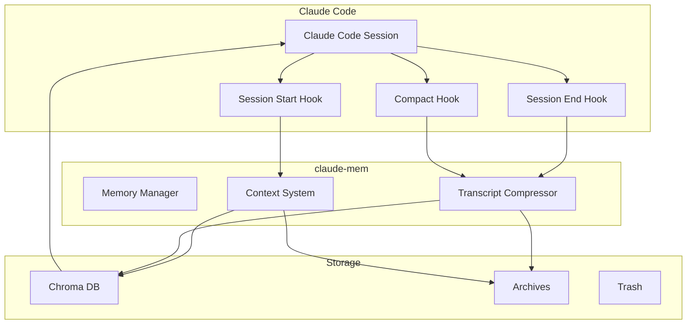
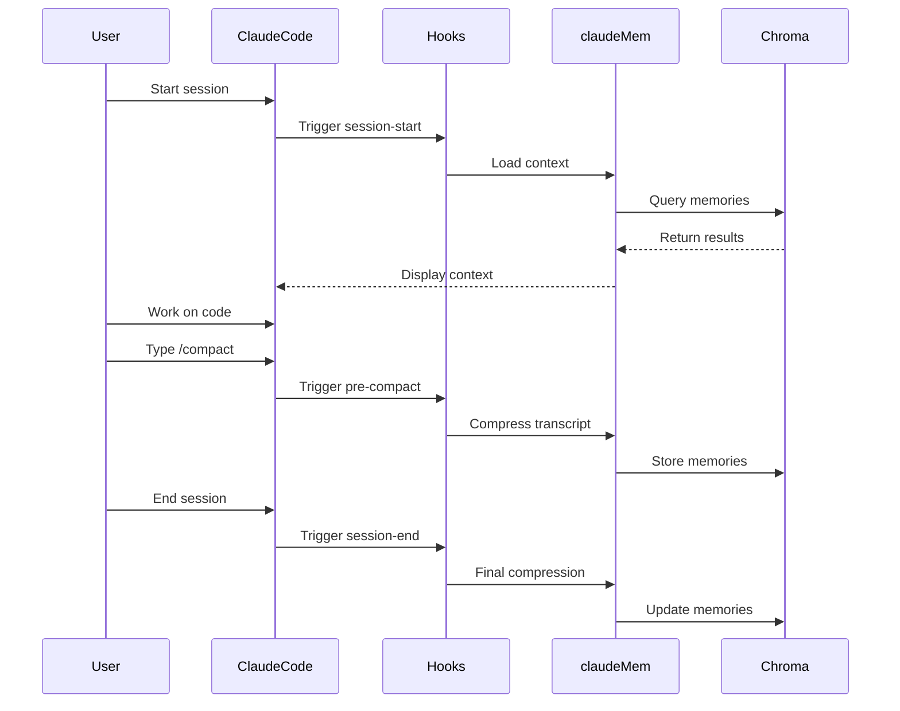

## How claude-mem Works

claude-mem creates a persistent memory layer for your Claude Code sessions, automatically capturing and recalling important context.

## Architecture Overview



## Key Components

### 1. Hook System

claude-mem integrates with Claude Code through three main hooks:

<CardGrid cols={3}>
  <Card title="session-start" icon="play">
    Loads relevant memories when you begin coding
  </Card>
  <Card title="session-end" icon="stop">
    Compresses and saves the conversation
  </Card>
  <Card title="pre-compact" icon="compress">
    Handles manual compression via `/compact`
  </Card>
</CardGrid>

### 2. Memory Compression

When a session ends or you trigger compression:

<Steps>
  <Step>
    **Extract Transcript** - Captures the conversation from Claude Code
  </Step>
  <Step>
    **Analyze Content** - Identifies key insights, solutions, and decisions
  </Step>
  <Step>
    **Generate Summaries** - Creates searchable memory documents
  </Step>
  <Step>
    **Store in Chroma** - Saves with metadata for semantic search
  </Step>
</Steps>

### 3. Context Loading

When you start a new session:

1. **Project Detection** - Identifies current working directory
2. **Semantic Search** - Queries Chroma for relevant memories
3. **Ranking** - Sorts by relevance and recency
4. **Display** - Shows formatted context in session start

## Memory Storage

claude-mem uses a document-based approach with Chroma DB:

```javascript
{
  // Document content
  content: "Implemented authentication using JWT tokens with refresh...",

  // Metadata for search and filtering
  metadata: {
    session_id: "abc123",
    timestamp: "2025-09-15T10:30:00Z",
    keywords: ["authentication", "jwt", "security"],
    project: "my-app",
    type: "feature"
  }
}
```

### Storage Locations

<FileTree>
  <Folder name="~/.claude-mem" defaultOpen>
    <Folder name="index" defaultOpen>
      <File name="chroma.sqlite3" />
      <Comment>Chroma vector database</Comment>
    </Folder>
    <Folder name="archives" defaultOpen>
      <File name="session_2025-09-15.json" />
      <Comment>Compressed transcripts</Comment>
    </Folder>
    <Folder name="trash" defaultOpen>
      <File name="deleted_memory.json" />
      <Comment>Recoverable deletions</Comment>
    </Folder>
  </Folder>
</FileTree>

## Compression Algorithm

The transcript compressor uses intelligent extraction:

<Tabs>
  <Tab title="Input Processing">
    ```typescript
    // Parses Claude Code transcript
    const messages = parseTranscript(transcript);

    // Filters relevant content
    const filtered = messages.filter(m =>
      m.role === 'assistant' &&
      m.content.length > 100
    );
    ```
  </Tab>

  <Tab title="Content Analysis">
    ```typescript
    // Extracts key information
    const insights = extractInsights(messages);
    const solutions = findSolutions(messages);
    const decisions = identifyDecisions(messages);
    ```
  </Tab>

  <Tab title="Memory Generation">
    ```typescript
    // Creates searchable documents
    const memories = generateMemories({
      insights,
      solutions,
      decisions,
      metadata: extractMetadata()
    });
    ```
  </Tab>
</Tabs>

## Semantic Search

claude-mem uses vector embeddings for intelligent retrieval:

1. **Query Embedding** - Converts search query to vector
2. **Similarity Search** - Finds closest matches in Chroma
3. **Metadata Filtering** - Applies project/time filters
4. **Result Ranking** - Orders by relevance score

```javascript
// Example search
const results = await chroma.query({
  queryTexts: ["authentication bug fix"],
  nResults: 5,
  where: { project: "current-project" }
});
```

## MCP Integration

claude-mem leverages Model Context Protocol (MCP) for Chroma:

<Note>
  MCP provides a standardized way for Claude Code to interact with external tools like Chroma DB.
</Note>

### MCP Server Configuration

```json
{
  "mcpServers": {
    "chromadb-claude-mem": {
      "command": "npx",
      "args": ["@modelcontextprotocol/server-chromadb"]
    }
  }
}
```

### Available MCP Tools

- `chroma_add_documents` - Store new memories
- `chroma_query_documents` - Search memories
- `chroma_get_documents` - Retrieve specific memories
- `chroma_delete_documents` - Remove memories

## Performance Optimization

claude-mem is designed for speed:

<CardGrid cols={2}>
  <Card title="Minified Bundle" icon="box">
    658KB production build with tree-shaking
  </Card>
  <Card title="Lazy Loading" icon="clock">
    Loads memories asynchronously
  </Card>
  <Card title="Efficient Compression" icon="compress">
    Processes transcripts in chunks
  </Card>
  <Card title="Smart Caching" icon="database">
    Caches frequent queries
  </Card>
</CardGrid>

## Data Flow Example

Here's a complete example of the claude-mem lifecycle:



## Next Steps

<CardGrid cols={3}>
  <Card title="Memory Compression" icon="compress" href="/concepts/memory-compression">
    Deep dive into compression
  </Card>
  <Card title="Context Loading" icon="download" href="/concepts/context-loading">
    How context is selected
  </Card>
  <Card title="Architecture" icon="building" href="/advanced/architecture">
    Technical architecture details
  </Card>
</CardGrid>