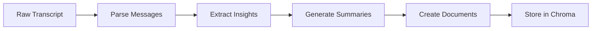

claude-mem uses intelligent compression to transform lengthy conversations into searchable, actionable memories.

## Compression Pipeline



## When Compression Happens

Compression triggers automatically:

<CardGrid cols={3}>
  <Card title="/compact command" icon="compress">
    Manual trigger during session
  </Card>
  <Card title="/clear command" icon="eraser">
    Optional save before clearing
  </Card>
  <Card title="Session end" icon="stop">
    Automatic on session close
  </Card>
</CardGrid>

## What Gets Compressed

The compressor analyzes conversations for:

### 1. Key Insights
- Problem solutions
- Bug fixes
- Implementation decisions
- Architecture choices

### 2. Code Changes
- New features added
- Refactoring performed
- Dependencies installed
- Configurations updated

### 3. Context
- Project information
- User preferences
- Technical decisions
- Future todos

## Compression Algorithm

<Tabs>
  <Tab title="Stage 1: Parsing">
    ```typescript
    // Extract structured messages
    const transcript = await readTranscript(sessionId);
    const messages = parseMessages(transcript);

    // Filter relevant content
    const relevant = messages.filter(msg => {
      return msg.role === 'assistant' &&
             msg.content.length > 100 &&
             containsInsight(msg.content);
    });
    ```
  </Tab>

  <Tab title="Stage 2: Analysis">
    ```typescript
    // Identify key information
    const analysis = {
      solutions: extractSolutions(messages),
      decisions: extractDecisions(messages),
      codeChanges: extractCodeChanges(messages),
      learnings: extractLearnings(messages)
    };
    ```
  </Tab>

  <Tab title="Stage 3: Summary">
    ```typescript
    // Generate memory documents
    const memories = [];

    for (const insight of analysis.solutions) {
      memories.push({
        content: summarize(insight),
        metadata: {
          type: 'solution',
          timestamp: new Date().toISOString(),
          session_id: sessionId,
          keywords: extractKeywords(insight)
        }
      });
    }
    ```
  </Tab>
</Tabs>

## Compression Strategies

claude-mem uses different strategies based on content:

### Code-Heavy Sessions

For sessions with lots of code:
- Extracts function/class definitions
- Captures implementation patterns
- Records dependency changes

### Discussion Sessions

For conceptual discussions:
- Summarizes decisions made
- Records architectural choices
- Captures requirements

### Debugging Sessions

For troubleshooting:
- Records error messages
- Documents solutions found
- Notes workarounds

## Memory Document Structure

Each compressed memory becomes a searchable document:

```json
{
  "id": "mem_abc123",
  "content": "Fixed authentication bug by updating JWT token validation...",
  "metadata": {
    "session_id": "session_xyz",
    "timestamp": "2025-09-15T10:30:00Z",
    "type": "bug_fix",
    "keywords": ["auth", "jwt", "validation"],
    "project": "my-app",
    "importance": "high"
  }
}
```

## Compression Levels

Configure compression in `settings.json`:

<Tabs>
  <Tab title="Minimal">
    ```json
    {
      "compressionLevel": "minimal",
      "maxMemoriesPerSession": 5
    }
    ```
    - Quick compression
    - Key points only
    - Small storage footprint
  </Tab>

  <Tab title="Balanced (Default)">
    ```json
    {
      "compressionLevel": "balanced",
      "maxMemoriesPerSession": 10
    }
    ```
    - Moderate detail
    - Good search coverage
    - Optimal performance
  </Tab>

  <Tab title="Comprehensive">
    ```json
    {
      "compressionLevel": "comprehensive",
      "maxMemoriesPerSession": 20
    }
    ```
    - Maximum detail
    - Full context preservation
    - Larger storage usage
  </Tab>
</Tabs>

## Smart Deduplication

claude-mem prevents duplicate memories:

1. **Content Hashing** - Detects identical content
2. **Similarity Check** - Finds near-duplicates
3. **Time Window** - Merges related memories
4. **Update Strategy** - Updates existing vs creating new

## Compression Output

After compression, you'll see:

```
✅ Compressed

5 memories extracted:
- Fixed authentication bug with JWT validation
- Implemented dark mode using Tailwind CSS
- Optimized database queries for dashboard
- Added error handling for API calls
- Configured CI/CD pipeline with GitHub Actions
```

## Manual Compression

Trigger compression manually:

```bash
# Via Claude Code
/compact

# Via CLI
claude-mem compress --session latest

# Specific session
claude-mem compress --session abc123
```

## Compression Statistics

View compression stats:

```bash
claude-mem stats
```

Output:
```
📊 Compression Statistics
────────────────────────

Total Sessions: 42
Compressed: 38
Total Memories: 312
Average per Session: 8.2
Storage Used: 12.4 MB
Compression Ratio: 94:1
```

## Performance

Compression is optimized for speed:

| Metric | Value |
|--------|-------|
| Average Time | 2-3 seconds |
| Memory Usage | < 50MB |
| CPU Usage | < 10% |
| Compression Ratio | 50:1 - 100:1 |

## Troubleshooting Compression

<AccordionGroup>
  <Accordion title="Compression not triggering">
    - Check hooks are installed: `claude-mem status`
    - Verify transcript exists: `ls ~/.claude/code/transcripts/`
    - Check logs: `claude-mem logs`
  </Accordion>

  <Accordion title="Low quality summaries">
    - Increase compression level in settings
    - Ensure sessions are substantial (> 5 messages)
    - Check for parsing errors in logs
  </Accordion>

  <Accordion title="Duplicate memories">
    - Run deduplication: `claude-mem dedupe`
    - Check time windows in settings
    - Review similarity threshold
  </Accordion>
</AccordionGroup>

## Best Practices

<CardGrid cols={2}>
  <Card title="Compress Regularly" icon="clock">
    Use `/compact` after completing features
  </Card>
  <Card title="Add Context" icon="comment">
    Include descriptive comments for better summaries
  </Card>
  <Card title="Review Memories" icon="eye">
    Periodically check what's being saved
  </Card>
  <Card title="Clean Old Data" icon="broom">
    Remove outdated memories periodically
  </Card>
</CardGrid>

## Next Steps

<CardGrid cols={3}>
  <Card title="Context Loading" icon="download" href="/concepts/context-loading">
    How memories are retrieved
  </Card>
  <Card title="Smart Trash" icon="trash" href="/concepts/smart-trash">
    Recovery system
  </Card>
  <Card title="API Reference" icon="code" href="/api-reference/compression-api">
    Compression API
  </Card>
</CardGrid>