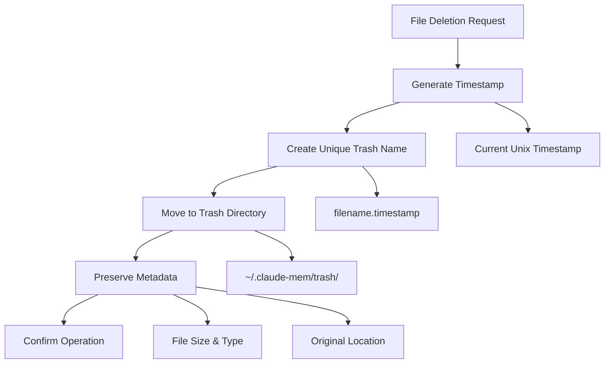
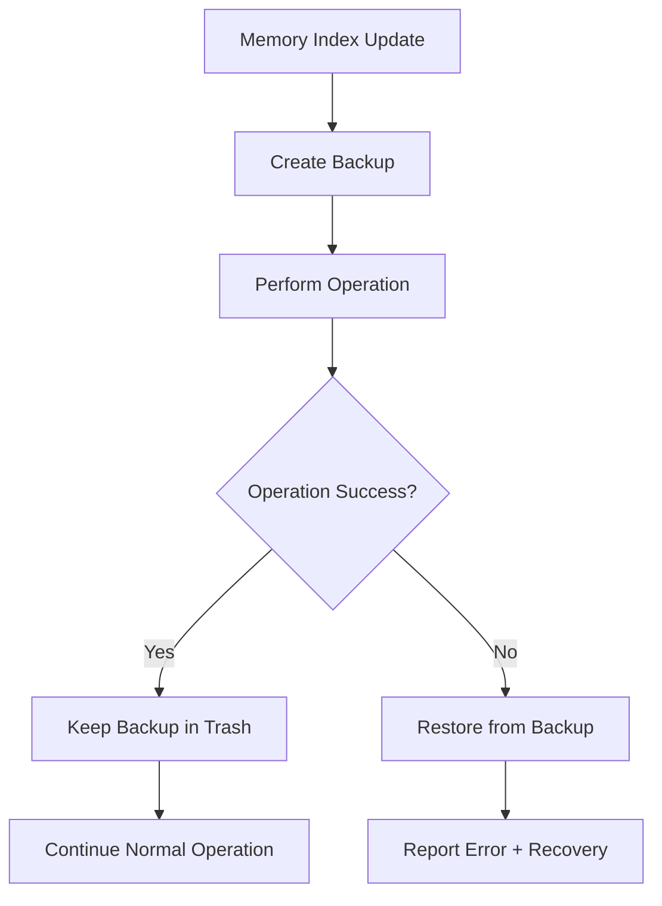

# Smart Trash System

claude-mem includes a comprehensive safe deletion system called "Smart Trash™" that protects against accidental data loss while maintaining a clean working environment. This system provides confidence when managing files and memories.

## Philosophy: Safe by Default

The Smart Trash system follows a "safe by default" approach:

- **Never permanently delete** - Everything goes to trash first
- **Timestamped recovery** - Track when things were deleted
- **Interactive restoration** - Easy browsing and recovery
- **Automatic cleanup** - Optional permanent deletion when ready

<CardGrid>
  <Card title="Safety First" icon="shield">
    **Zero Data Loss**
    - All deletions are moves to trash
    - Timestamped for identification
    - Full directory structure preserved
    - Metadata maintained for recovery
  </Card>
  <Card title="Easy Recovery" icon="arrow-up">
    **One-Command Restore**
    - Interactive file selection
    - Preview before restoration
    - Restore to original or new location
    - Batch restoration support
  </Card>
  <Card title="Smart Organization" icon="folder">
    **Intelligent Management**
    - Automatic conflict resolution
    - Size and age tracking
    - Type-aware handling
    - Clean trash browsing
  </Card>
  <Card title="Performance Aware" icon="gauge">
    **Efficient Operation**
    - Fast move operations
    - Lazy size calculation
    - Background cleanup
    - Minimal disk overhead
  </Card>
</CardGrid>

## How Smart Trash Works

### Deletion Process

When you delete files using claude-mem's trash system:



### Trash Directory Structure

```
~/.claude-mem/trash/
├── project-notes.txt.1694789234     # Deleted 2 hours ago
├── old-config.json.1694785634       # Deleted 3 hours ago
├── backup-folder.1694782034/        # Deleted yesterday
│   ├── data.json
│   └── logs/
│       └── debug.log
└── temp-script.sh.1694778434        # Deleted 2 days ago
```

### Naming Convention

Smart Trash uses a predictable naming convention:

```
original-filename.timestamp
```

- **Original filename**: Preserves exact name for easy identification
- **Timestamp**: Unix timestamp when file was trashed
- **Extension preservation**: File extensions are maintained
- **Conflict resolution**: Automatic timestamp uniqueness

## Core Commands

### Moving Files to Trash

The `claude-mem trash` command safely deletes files:

<AccordionGroup>
  <Accordion title="Basic File Deletion">
    ```bash
    # Delete single file
    claude-mem trash unwanted-file.txt

    # Delete multiple files
    claude-mem trash file1.txt file2.log config.old

    # Delete with glob patterns
    claude-mem trash "*.tmp"
    claude-mem trash "old-*"
    ```

    **Output**:
    ```
    Moved unwanted-file.txt to trash
    Moved file1.txt to trash
    Moved file2.log to trash
    ```
  </Accordion>

  <Accordion title="Directory Deletion">
    ```bash
    # Delete directory (requires -r flag)
    claude-mem trash -r old-project/

    # Alternative syntax
    claude-mem trash --recursive backup-folder/

    # Force deletion (suppress errors)
    claude-mem trash -rf missing-file.txt nonexistent-dir/
    ```

    **Directory Handling**:
    - Entire directory structure preserved
    - Recursive flag required for safety
    - Subdirectories maintain relationships
    - File permissions preserved
  </Accordion>

  <Accordion title="Advanced Options">
    ```bash
    # Force deletion (ignore missing files)
    claude-mem trash -f file-that-might-not-exist.txt

    # Recursive + force (common pattern)
    claude-mem trash -rf temp/ cache/ *.log

    # Alternative recursive syntax
    claude-mem trash -R important-data/  # Same as -r
    ```

    **Force Mode Benefits**:
    - Scripting-friendly (no error interruption)
    - Handles missing files gracefully
    - Continues with remaining files
    - Exit code 0 even with missing files
  </Accordion>
</AccordionGroup>

### Viewing Trash Contents

The `claude-mem trash view` command provides detailed trash inspection:

```bash
claude-mem trash view
```

**Example Output**:
```
🗑️  Trash Contents

────────────────────────────────────────────────────────────────────────────────
📄 project-notes.txt
   Size: 2.3 KB | Trashed: 9/15/2024, 10:30:15 AM
   ID: project-notes.txt.1694789215

📁 old-backup
   Size: 15.7 MB | Trashed: 9/14/2024, 3:45:22 PM
   ID: old-backup.1694702722

📄 config.json
   Size: 856 B | Trashed: 9/14/2024, 11:20:08 AM
   ID: config.json.1694687208

────────────────────────────────────────────────────────────────────────────────
Total: 1 folders, 2 files (15.7 MB)

To restore files: claude-mem restore
To empty trash:   claude-mem trash empty
```

### Interactive File Restoration

The `claude-mem restore` command provides guided file recovery:

<Steps>
  <Step title="Launch Interactive Restore">
    ```bash
    claude-mem restore
    ```

    If trash is empty:
    ```
    Trash is empty
    ```
  </Step>

  <Step title="Select File to Restore">
    ```
    ? Select file to restore: ›
    ❯ project-notes.txt.1694789215
      old-backup.1694702722
      config.json.1694687208
    ```

    Use arrow keys to navigate, Enter to select.
  </Step>

  <Step title="Confirm Restoration">
    ```
    Restored project-notes.txt
    ```

    File is moved from trash back to current directory with original name.
  </Step>
</Steps>

### Permanent Deletion

The `claude-mem trash empty` command permanently removes all trash contents:

```bash
# Interactive confirmation
claude-mem trash empty

# Force empty (skip confirmation)
claude-mem trash empty --force
```

**Interactive Flow**:
```
? Are you sure you want to permanently delete all trash contents? › (y/N)
```

<Warning>
  **Permanent Deletion**: The `trash empty` command permanently deletes all files in trash. This operation cannot be undone. Consider backing up important files before emptying trash.
</Warning>

## Advanced Features

### Timestamp-Based Recovery

Since files are timestamped, you can identify when they were deleted:

```typescript
// Understanding timestamp format
const timestamp = 1694789215;
const deletionDate = new Date(timestamp * 1000);
console.log(deletionDate.toLocaleString());
// Output: "9/15/2024, 10:30:15 AM"
```

### Size Tracking

Smart Trash automatically calculates and displays file sizes:

<AccordionGroup>
  <Accordion title="File Size Calculation">
    **Individual Files**:
    ```typescript
    const stats = fs.statSync(filePath);
    const size = stats.size; // Bytes
    ```

    **Size Formatting**:
    - Bytes: `1,234 B`
    - Kilobytes: `2.3 KB`
    - Megabytes: `15.7 MB`
    - Gigabytes: `1.2 GB`
  </Accordion>

  <Accordion title="Directory Size Calculation">
    **Recursive Directory Sizing**:
    ```typescript
    function getDirectorySize(dirPath: string): number {
      let size = 0;
      const files = fs.readdirSync(dirPath);

      for (const file of files) {
        const filePath = path.join(dirPath, file);
        const stats = fs.statSync(filePath);

        if (stats.isDirectory()) {
          size += getDirectorySize(filePath); // Recursive
        } else {
          size += stats.size;
        }
      }

      return size;
    }
    ```

    **Performance Note**: Directory size calculation is performed on-demand to avoid startup delays.
  </Accordion>
</AccordionGroup>

### Conflict Resolution

When restoring files, Smart Trash handles conflicts intelligently:

<Steps>
  <Step title="Name Conflict Detection">
    ```bash
    # If restoring to location where file already exists
    claude-mem restore
    # Selects: project-notes.txt.1694789215
    ```

    System checks if `project-notes.txt` already exists in current directory.
  </Step>

  <Step title="Automatic Resolution">
    **Current Behavior**: Overwrites existing file
    **Future Enhancement**: Prompt for conflict resolution:

    ```
    ? File 'project-notes.txt' already exists. How should we handle this? ›
    ❯ Overwrite existing file
      Restore with new name (project-notes-restored.txt)
      Skip restoration
      Compare files first
    ```
  </Step>
</Steps>

## Integration with Memory System

### Memory-Specific Operations

Smart Trash integrates with claude-mem's memory management:

```bash
# Trash memory archives safely
claude-mem trash ~/.claude-mem/archives/old-session.json

# Restore accidentally deleted memory index
claude-mem restore
# Select: index.jsonl.1694789215
```

### Automatic Backup Protection

Before major operations, claude-mem creates automatic backups:



### Memory Cleanup Workflow

Safely clean up old memories:

<Steps>
  <Step title="Identify Old Memories">
    ```bash
    # Check memory index size
    wc -l ~/.claude-mem/index/index.jsonl

    # Review old memories
    head -100 ~/.claude-mem/index/index.jsonl
    ```
  </Step>

  <Step title="Backup Before Cleanup">
    ```bash
    # Create backup
    cp ~/.claude-mem/index/index.jsonl ~/.claude-mem/index/index.jsonl.backup

    # Move backup to trash for safety
    claude-mem trash ~/.claude-mem/index/index.jsonl.backup
    ```
  </Step>

  <Step title="Perform Cleanup">
    ```bash
    # Remove old entries (keep last 500)
    tail -500 ~/.claude-mem/index/index.jsonl > ~/.claude-mem/index/index.jsonl.new
    mv ~/.claude-mem/index/index.jsonl.new ~/.claude-mem/index/index.jsonl
    ```
  </Step>

  <Step title="Verify and Restore if Needed">
    ```bash
    # Test memory loading
    claude-mem load-context

    # If something went wrong, restore backup
    claude-mem restore
    # Select: index.jsonl.backup.timestamp
    ```
  </Step>
</Steps>

## Best Practices

### Regular Trash Maintenance

<AccordionGroup>
  <Accordion title="Weekly Trash Review">
    ```bash
    # Review trash contents weekly
    claude-mem trash view

    # Restore any needed files
    claude-mem restore

    # Empty trash of old items
    claude-mem trash empty
    ```

    **Benefits**:
    - Prevents accumulation of unnecessary files
    - Opportunity to recover forgotten files
    - Maintains system performance
  </Accordion>

  <Accordion title="Project Cleanup Workflow">
    ```bash
    # End-of-project cleanup
    cd ~/projects/completed-project/

    # Move entire project to trash
    cd ..
    claude-mem trash -r completed-project/

    # Review what was trashed
    claude-mem trash view

    # Later, when confident it's not needed:
    claude-mem trash empty
    ```
  </Accordion>
</AccordionGroup>

### Safe Deletion Patterns

```bash
# Good: Use trash for all deletions
claude-mem trash old-files/
claude-mem trash *.tmp
claude-mem trash build/ dist/

# Avoid: Direct rm commands (no recovery)
# rm -rf important-data/  # Dangerous!

# Good: Force flag for scripting
claude-mem trash -rf temp/ || echo "Some files already gone"

# Good: Review before permanent deletion
claude-mem trash view
claude-mem trash empty  # Only after review
```

### Memory Safety Patterns

```bash
# Always backup before major changes
cp ~/.claude-mem/index/index.jsonl ~/.claude-mem/index/backup.jsonl
claude-mem trash ~/.claude-mem/index/backup.jsonl

# Test memory operations
claude-mem load-context --dry-run

# Restore if problems occur
claude-mem restore  # Select backup file
```

## Troubleshooting

### Common Issues

<AccordionGroup>
  <Accordion title="Permission Denied">
    **Error**: `EACCES: permission denied`

    **Solutions**:
    ```bash
    # Check trash directory permissions
    ls -la ~/.claude-mem/trash/

    # Fix permissions
    chmod 755 ~/.claude-mem/trash/

    # Check file ownership
    ls -la file-to-delete.txt
    ```
  </Accordion>

  <Accordion title="Trash Directory Missing">
    **Error**: `ENOENT: no such file or directory`

    **Solutions**:
    ```bash
    # Recreate trash directory
    mkdir -p ~/.claude-mem/trash/

    # Verify installation
    claude-mem status

    # Reinstall if needed
    claude-mem install --force
    ```
  </Accordion>

  <Accordion title="Restore Fails">
    **Error**: File restoration doesn't work

    **Solutions**:
    ```bash
    # Check trash contents
    ls -la ~/.claude-mem/trash/

    # Verify file exists
    claude-mem trash view

    # Manual restoration if needed
    mv ~/.claude-mem/trash/filename.timestamp ./filename
    ```
  </Accordion>
</AccordionGroup>

### Recovery Scenarios

<AccordionGroup>
  <Accordion title="Accidentally Emptied Trash">
    **Problem**: Ran `claude-mem trash empty` by mistake

    **Recovery Options**:
    1. **File system recovery tools** (platform-specific)
    2. **Time Machine/backup restoration** (if available)
    3. **Git recovery** (if files were under version control)
    4. **Archive restoration** (for memory-related files)

    **Prevention**:
    ```bash
    # Always review before emptying
    claude-mem trash view
    # Look for important files before:
    claude-mem trash empty
    ```
  </Accordion>

  <Accordion title="Corrupted Trash Directory">
    **Problem**: Trash directory has permission or structure issues

    **Recovery**:
    ```bash
    # Backup existing trash
    mv ~/.claude-mem/trash ~/.claude-mem/trash.backup

    # Recreate trash system
    claude-mem install --force

    # Manually move files back if needed
    mv ~/.claude-mem/trash.backup/* ~/.claude-mem/trash/
    ```
  </Accordion>
</AccordionGroup>

## Future Enhancements

The Smart Trash system is continuously evolving:

<CardGrid>
  <Card title="Automated Cleanup" icon="clock">
    **Planned Features**
    - Automatic deletion of old trash files
    - Configurable retention policies
    - Size-based cleanup triggers
    - Smart cleanup suggestions
  </Card>
  <Card title="Enhanced Recovery" icon="search">
    **Advanced Restore**
    - Search trash by content
    - Filter by date ranges
    - Bulk restoration options
    - Preview before restore
  </Card>
  <Card title="Conflict Resolution" icon="git-merge">
    **Smart Merging**
    - Automatic conflict detection
    - File comparison tools
    - Merge operation support
    - Version history tracking
  </Card>
  <Card title="Cloud Integration" icon="cloud">
    **Backup Sync**
    - Cloud trash synchronization
    - Multi-device trash access
    - Remote restoration
    - Shared trash spaces
  </Card>
</CardGrid>

---

The Smart Trash system provides the confidence to manage files and memories without fear of permanent data loss, making claude-mem a safe and reliable tool for development workflows.