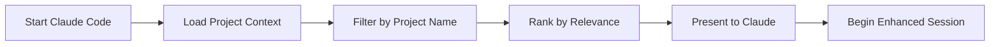

## Installation First

<Card title="🚀 Haven't installed yet?" icon="download" href="/quickstart">
  Start with our one-command Quick Start guide
</Card>

Already installed? Learn how to use claude-mem effectively.

## What You Get

After installing claude-mem, you have:

<CardGrid>
  <Card title="Instant Memory" icon="brain">
    Every conversation saved and searchable automatically
  </Card>
  <Card title="Smart Context" icon="sparkles">
    Relevant memories load when you start coding
  </Card>
  <Card title="Zero Effort" icon="wand-magic-sparkles">
    No commands needed - automatic operation
  </Card>
  <Card title="Safe Deletion" icon="shield">
    Smart Trash keeps everything recoverable
  </Card>
</CardGrid>

## Your First Session

<Steps>
  <Step title="Start Claude Code">
    Open any project. You'll see claude-mem load automatically:

    ```
    🧠 Claude Memory System - Active
    📚 Loading relevant memories...
    ✨ Ready. Start coding.
    ```
  </Step>

  <Step title="Work Normally">
    Code as you always do. claude-mem captures everything in the background. No manual commands needed.
  </Step>

  <Step title="Save a Memory">
    When you want to save the conversation, type:

    ```
    /compact
    ```

    Or just use `/clear` - it saves automatically before clearing.
  </Step>

  <Step title="See It Work">
    Start a new session. Your memories load instantly:

    ```
    🧠 Previous context loaded
    📚 Found relevant memories from earlier sessions
    ```
  </Step>
</Steps>

## How Memories Build Up

Each session adds to Claude's understanding:

**Session 1:** "I'm building a React app with TypeScript"
**Session 2:** Claude remembers React + TypeScript
**Session 3:** "Add authentication" → Claude knows: React + TS + auth needs
**Session 4:** Claude suggests JWT because that's what you used before

Automatic. No commands. No configuration.

## Understanding Memory Behavior

### What Gets Remembered

claude-mem stores:

- **Project insights**: Architecture decisions, technical requirements, and goals
- **Problem-solving patterns**: How you approach and solve specific types of issues
- **Code preferences**: Your coding style, preferred libraries, and patterns
- **Decision rationale**: Why certain choices were made
- **Key learnings**: Important discoveries and insights from your sessions

### What Doesn't Get Remembered

Excluded for privacy and relevance:

- **Sensitive information**: API keys, passwords, or personal data
- **Verbose debugging output**: Long error logs or repetitive troubleshooting
- **Off-topic conversations**: Discussions unrelated to your development work
- **Transient state**: Temporary variables, current session specifics

### Memory Loading

<Tip>
  **Smart Context Loading**: claude-mem loads relevant memories based on your current project. It uses the directory name to filter and prioritize the most relevant context.
</Tip>



## Essential Commands

Here are the commands you'll use most frequently:

<AccordionGroup>
  <Accordion title="claude-mem status - Check System Health">
    ```bash
    claude-mem status
    ```

    Shows installation status, memory count, and system health. Use this to troubleshoot issues or verify everything is working.
  </Accordion>

  <Accordion title="claude-mem load-context - Preview Memories">
    ```bash
    # View recent memories for current project
    claude-mem load-context

    # View memories for a specific project
    claude-mem load-context --project my-project

    # Get raw JSON output
    claude-mem load-context --format json
    ```

    Perfect for understanding what Claude will remember about your project.
  </Accordion>

  <Accordion title="claude-mem logs - Troubleshoot Issues">
    ```bash
    # View recent logs
    claude-mem logs

    # Follow logs in real-time
    claude-mem logs --follow

    # View only errors
    claude-mem logs --error
    ```

    Essential for debugging when memories aren't loading correctly.
  </Accordion>

  <Accordion title="claude-mem save - Manual Memory Creation">
    ```bash
    claude-mem save "Important insight about authentication patterns"
    ```

    Manually save important insights that you want Claude to remember.
  </Accordion>
</AccordionGroup>

## File System Overview

claude-mem creates a clean directory structure:

```
~/.claude-mem/
├── index/           # Compressed memory index (JSONL format)
├── archives/        # Raw conversation transcripts
├── hooks/           # Claude Code integration scripts
├── trash/           # Safe deletion recovery (Smart Trash)
└── logs/           # Operation logs for troubleshooting
```

<Warning>
  **Don't edit these files manually**. Use claude-mem CLI commands. Direct modification corrupts the index.
</Warning>

## Next Steps

<CardGrid>
  <Card title="Best Practices" icon="lightbulb" href="/guides/best-practices">
    Learn how to maximize the effectiveness of your memory system
  </Card>
  <Card title="Troubleshooting" icon="tools" href="/guides/troubleshooting">
    Common issues and how to resolve them quickly
  </Card>
  <Card title="Context Loading" icon="download" href="/concepts/context-loading">
    Understand how memories are loaded and prioritized
  </Card>
  <Card title="Smart Trash" icon="trash" href="/concepts/smart-trash">
    Learn about the safe deletion and recovery system
  </Card>
</CardGrid>

## Quick Troubleshooting

If something doesn't work as expected:

1. **Check Status**: Run `claude-mem status` to identify issues
2. **Reinstall Hooks**: Try `claude-mem install --force`
3. **Restart Claude Code**: Completely restart the application
4. **Check Logs**: Use `claude-mem logs --error` to see error details

<Tip>
  Most issues are resolved by running `claude-mem install --force` and restarting Claude Code. This refreshes all integration components.
</Tip>

---

You're ready to use persistent context in Claude Code. Every conversation builds on the last.