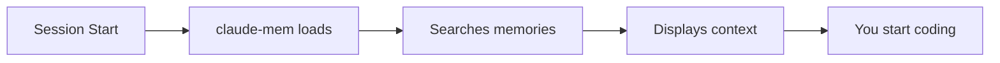
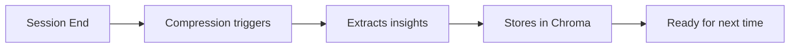

import { Steps } from '/snippets/steps.mdx'
import { Tabs, Tab } from '/snippets/tabs.mdx'

# Quick Start

Get claude-mem installed and working with Claude Code in less than a minute.

## Prerequisites

<Card title="Requirements" icon="check">
  - Node.js 18+ installed
  - Claude Code desktop app
  - npm or bun package manager
</Card>

## Installation

<Steps>

### Install claude-mem globally

<Tabs>
  <Tab title="npm">
    ```bash
    npm install -g claude-mem
    ```
  </Tab>
  <Tab title="bun">
    ```bash
    bun install -g claude-mem
    ```
  </Tab>
</Tabs>

### Run the installer

```bash
claude-mem install
```

This command will:
- Set up Claude Code hooks
- Configure MCP server integration
- Add instructions to your CLAUDE.md
- Create necessary directories

### Restart Claude Code

Close and reopen Claude Code to activate the integration.

### Verify installation

```bash
claude-mem status
```

You should see:
```
✅ Installation Status: Complete
✅ Hooks: Installed
✅ MCP Server: Configured
✅ Settings: Found
```

</Steps>

## Your First Memory

Once installed, claude-mem works automatically:

1. **Start coding** - Open any project in Claude Code
2. **Work normally** - claude-mem captures your conversation
3. **Save memories** - Type `/compact` or `/clear` to compress
4. **Automatic loading** - Next session loads relevant context

<Note>
  Memories are compressed when you use `/compact` or `/clear` commands in Claude Code, or when the session ends.
</Note>

## What Happens Behind the Scenes

When you start a new Claude Code session:



When you end a session:



## Test It Out

Try this simple test:

1. Open a project in Claude Code
2. Ask Claude: "Remember that I prefer tabs over spaces"
3. Type `/compact` to save the memory
4. Start a new session
5. You'll see your preference loaded automatically!

## Common Commands

<CardGrid cols={2}>
  <Card title="claude-mem status" icon="heart-pulse">
    Check if everything is working
  </Card>
  <Card title="claude-mem load-context" icon="download">
    Preview what memories are available
  </Card>
  <Card title="claude-mem logs" icon="scroll">
    View recent activity logs
  </Card>
  <Card title="claude-mem install --force" icon="wrench">
    Reinstall/fix any issues
  </Card>
</CardGrid>

## Next Steps

<CardGrid cols={3}>
  <Card title="How It Works" icon="cog" href="/concepts/how-it-works">
    Understand the architecture
  </Card>
  <Card title="Configuration" icon="sliders" href="/configuration/settings">
    Customize your setup
  </Card>
  <Card title="CLI Reference" icon="terminal" href="/cli/overview">
    Explore all commands
  </Card>
</CardGrid>

## Troubleshooting

<AccordionGroup>
  <Accordion title="Installation failed">
    Run `claude-mem install --force` to reinstall
  </Accordion>
  <Accordion title="Memories not loading">
    Check `claude-mem status` and ensure MCP server is running
  </Accordion>
  <Accordion title="Command not found">
    Ensure claude-mem is in your PATH: `npm list -g claude-mem`
  </Accordion>
</AccordionGroup>

<Tip>
  If you encounter any issues, check our [troubleshooting guide](/guides/troubleshooting) or [open an issue](https://github.com/thedotmack/claude-mem/issues).
</Tip>